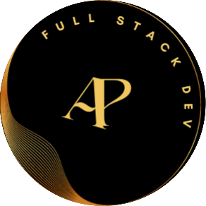
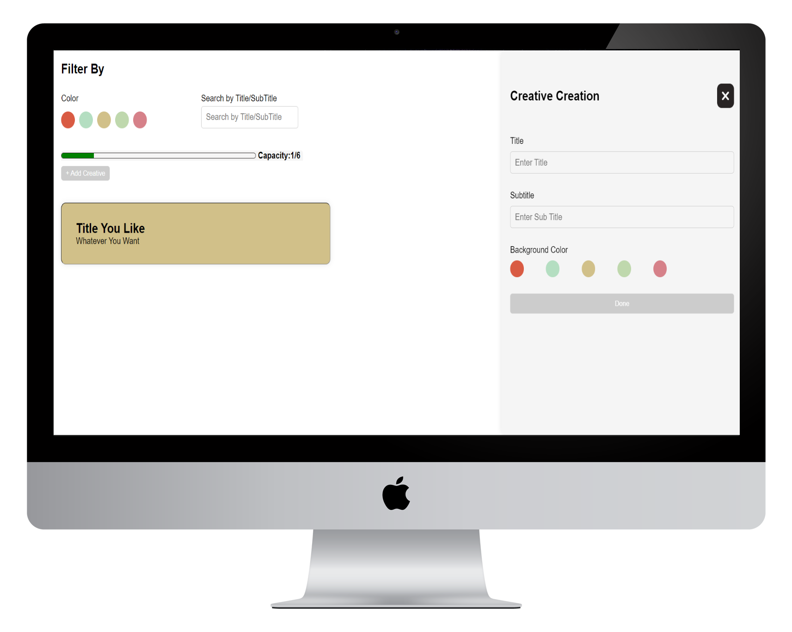

  
  <h1>Thinkify Labs TakeAway</h1>

# Table of Content 
- [Linters And Deployment](#linters-and-deployment)
- [Mocks](#mocks)
- [Folder Structure](#folder-structure)
- [Description](#description)
- [Tech Stack](#tech-stack)

# Linters and Deployment 

# Mocks

  

# Folder structure

- [src](./src/)
  - [app (For the redux store)](./src/app/store.js)
  - [assets (images gif etc)](./src/assets/)
  - [components (pages and respective shared)](./src/components/)
    - [pages (contain respective pages and there components)](./src//components/pages/)
    - [shared (contain components that shared across more than one page)](./src/components/shared/)
  - [features (respective redux slice and api slices)](./src/features/)
    - [api (RTK query for th api)](./src/features/api/)
    - ...
  - [hooks (contain custom hooks)](./src//hooks/)
  - [lib (data or type data if needed)](./src/lib/)
  - [style (contains all styling for the respective components)](./src/style/)

# Description
This is just an assignment project for Thinkify Labs as part of the recruitment process.

## Tech Stack 
- [x] React
- [x] Redux
- [x] CSS
- [x] JSX